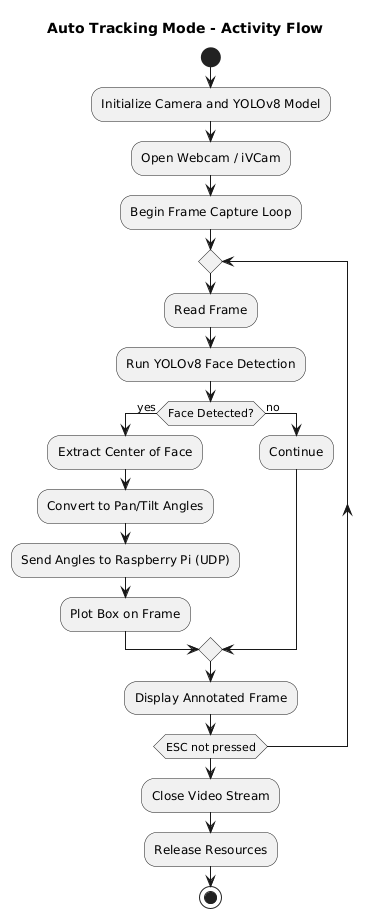
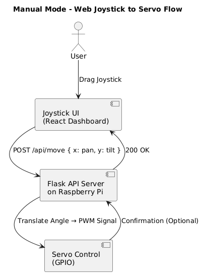
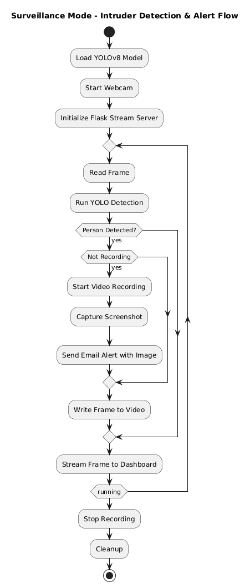

# 🛡️ Sentinel 360° AI Turret  
> A Raspberry Pi-powered smart surveillance and tracking turret with facial recognition, real-time pan-tilt control, and an interactive web dashboard.

---

## 🎯 What is Sentinel-360?

**Sentinel 360°** is more than just a security camera — it's a real-time **autonomous surveillance and tracking system powered by AI**.  
Equipped with facial recognition, servo-based targeting, and emergency alert capabilities, it delivers **next-gen security intelligence** for any environment.

---

## 📂 Repository Structure

This project is split into **3 core components**, each with its **own detailed README** for setup and code explanation:

- [`frontend/`](./frontend) — Web Dashboard built with Next.js → [Frontend README](./frontend/README.md)  
- [`backend/`](./backend) — PC-side YOLOv8 detection + Flask server → [Backend README](./backend/README.md)  
- [`pi/`](./pi) — Raspberry Pi code for controlling pan/tilt servos → [Pi README](./pi/README.md)  
- [`diagrams/`](./diagrams) — UML diagrams, system workflows  
- [`presentation/`](./presentation) — Final project slides and timeline

---

## 🚀 Features

- 🎯 **Auto Tracking Mode** – Face recognition + automatic targeting using YOLOv8 + UDP
- 🕹️ **Manual Mode** – Joystick control via futuristic web dashboard
- 🔒 **Surveillance Mode** – Detects people, records footage, sends email alert with screenshot
- 🌐 **Next.js Dashboard** – Interactive, responsive UI to switch modes and monitor turret status
- 📷 **Live Video Feed** – View camera feed from any mode in real time
- 📬 **Email Notification** – Sends alert when intruder is detected with timestamp & screenshot
- 🤖 **Servo System** – 360° horizontal + 90° vertical movement powered by Raspberry Pi

---

## 🧠 Intelligent Workflow Overview

  
📍 **System Overview** — Frontend → Flask (PC) → Servo Control (Pi)

---

## 📊 UML & Architecture Diagrams  
📂 Located in: [`diagrams/`](./diagrams/)

-   
  **auto-tracking-mode.png** — Shows how face detection → angle calculation → servo movement works

-   
  **manual-mode.png** — Illustrates joystick data → Pi via UDP → real-time servo control

-   
  **surveillance-mode.png** — Flow of detecting a person → recording footage → sending email

---
🌐 Live Web Dashboard
Try the fully interactive dashboard here:
🔗 https://sentinel-360-ai-turret.vercel.app

Hosted on Vercel. Switch modes, view live feed, and experience the futuristic control panel in action.
## 🎬 Demo Video

Watch the full demonstration on YouTube:  
📽️ [https://youtu.be/pR1h6KWUKuw](https://youtu.be/pR1h6KWUKuw)

---

## 👨‍💻 Meet the Team

### 🧠 Osman Deol  
**Role:** Lead Developer  
**Focus:** Backend · AI Integration · Project Architecture  
> *"I engineered the ML pipeline, coordinated backend/frontend integration, and drove the overall vision."*

---

### 🛠️ Umberto De Luca  
**Role:** Hardware Engineer  
**Focus:** Raspberry Pi · Servo System · Power Architecture  
> *"I wired and configured the servo control system and ensured all hardware components were functional and precise."*

---

### ⚙️ David Ursu  
**Role:** Hardware Assistant  
**Focus:** GPIO Configuration · Mechanical Setup  
> *"I contributed to servo calibration and the physical assembly of the turret and pan-tilt mechanism."*

---

### 💻 Joel deHoog  
**Role:** Frontend Assistant  
**Focus:** React Integration · Web Dashboard Components  
> *"I contributed to refining the web interface and supported frontend integration with the Flask backend."*

---

## 📈 Vision & Future Work

Sentinel 360° has immense potential beyond this prototype:

- Expand to **multi-turret systems** for larger areas  
- Integrate **license plate or object detection**  
- Add **facial recognition whitelist/blacklist logic**  
- Deploy on edge devices like **Jetson Nano or Coral TPU**  
- Enable **remote control and SMS/Push alerts**  
- Integrate with **drone surveillance or robotic patrols**  

---

## 🧾 About This Repository

✅ Complete project source code and configuration  
✅ 3 Operating Modes (Auto, Manual, Surveillance)  
✅ Diagrams + media + demo video  
✅ Packaged for submission with clear documentation  

📍 **Every folder has a dedicated README** — start from root and follow setup instructions step-by-step!

---

## 📜 License

MIT License © 2025

---

🔗 GitHub Repo: [github.com/OsmanDeol/Sentinel-360-ai-turret](https://github.com/OsmanDeol/Sentinel-360-ai-turret)
